<p align="center">
    
</p>


## MambaTSR: You Only Need 90k Parameters for Traffic Sign Recognition


### Our work “MambaTSR: You Only Need 90k Parameters for Traffic Sign Recognition” has been accepted by Neurocomputing(JCR Q1) 🎉🎉🎉 and the paper will online soon!


### [[Paper](https://www.sciencedirect.com/science/article/abs/pii/S0925231224008750)] 

[Zhihao Chen](https://scholar.google.com/citations?user=SBoHvVQAAAAJ&hl=zh-CN), [Yiyuan Ge](https://scholar.google.com/citations?user=qKxpHGcAAAAJ&hl=zh-CN), Mingxin Yu, Qing Yue, Lianqing Zhu


<p align="center">
    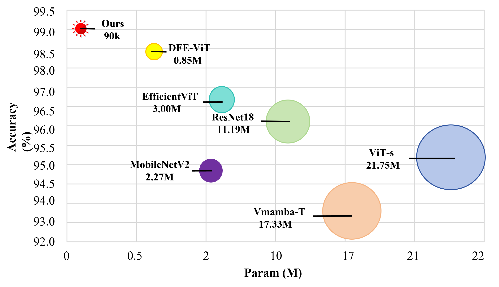
</p>


<p align="center">
    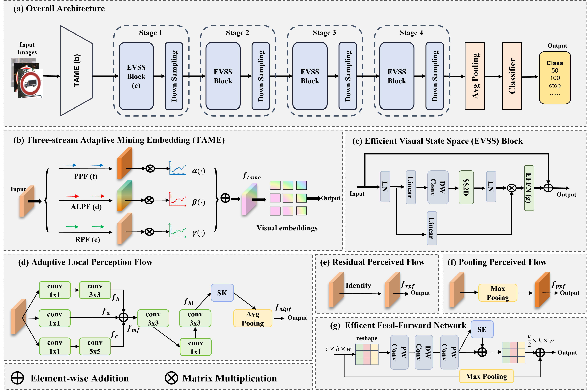
</p>


⭐If this work is helpful for you, please help star this repo. Thanks!🤗


<a name="Getting_Started">
</a>

## Getting Started

### Installation

**Step 1: Clone the VMamba repository:**

To get started, first clone the MambaTSR repository and navigate to the project directory:

```bash
git clone https://github.com/1024AILab/MambaTSR.git
cd MambaTSR
```

**Step 2: Environment Setup:**

MambaTSR recommends setting up a conda environment and installing dependencies via pip. Use the following commands to set up your environment:

***Create and activate a new conda environment***

```bash
conda create -n vmamba
conda activate vmamba
```

***Install Dependencies***

```bash
pip install -r requirements.txt
cd kernels/selective_scan && pip install .
```


## Samples

### AdditiveGaussianNoise


#### mean = 0

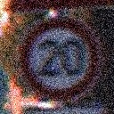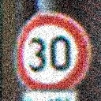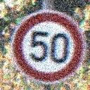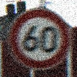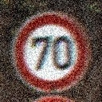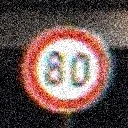


#### mean = 120

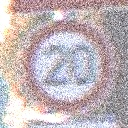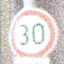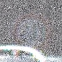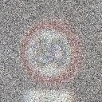


#### mean = -120

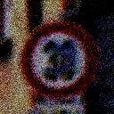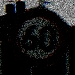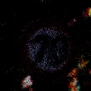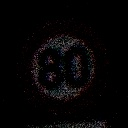


### Rain


#### s = 3.0

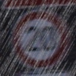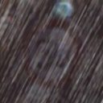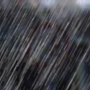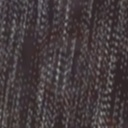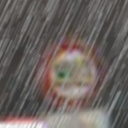


#### s = 7.0

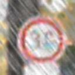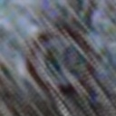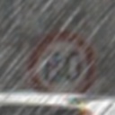


## You can download the datasets at 链接：https://pan.baidu.com/s/1T8sp81USl5AClQmvf0IzPw 

提取码：gdr8
